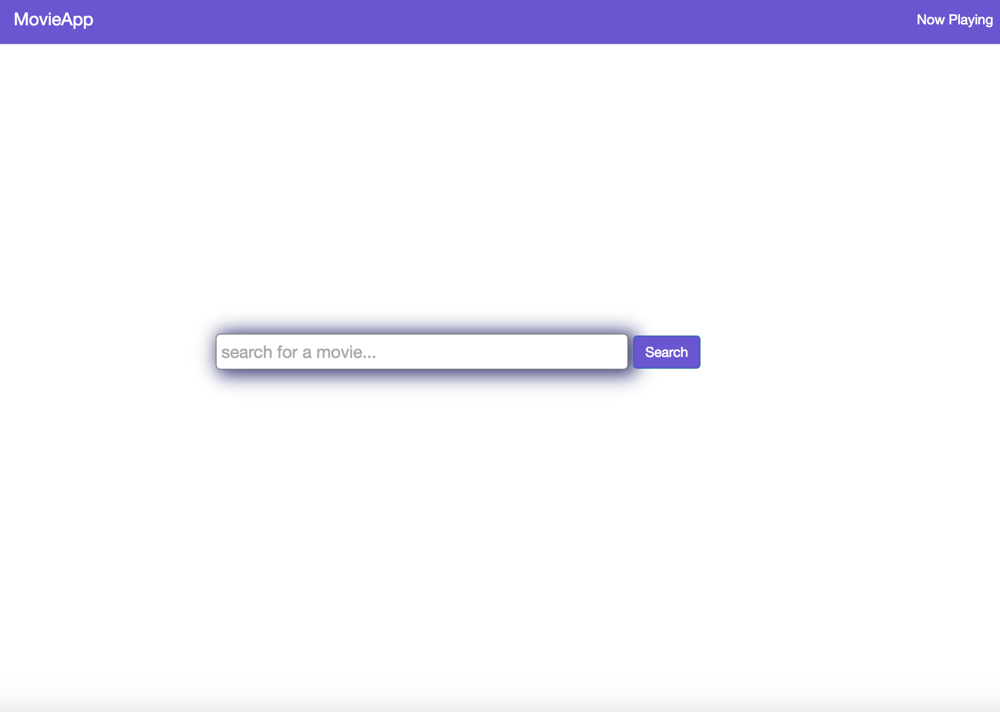
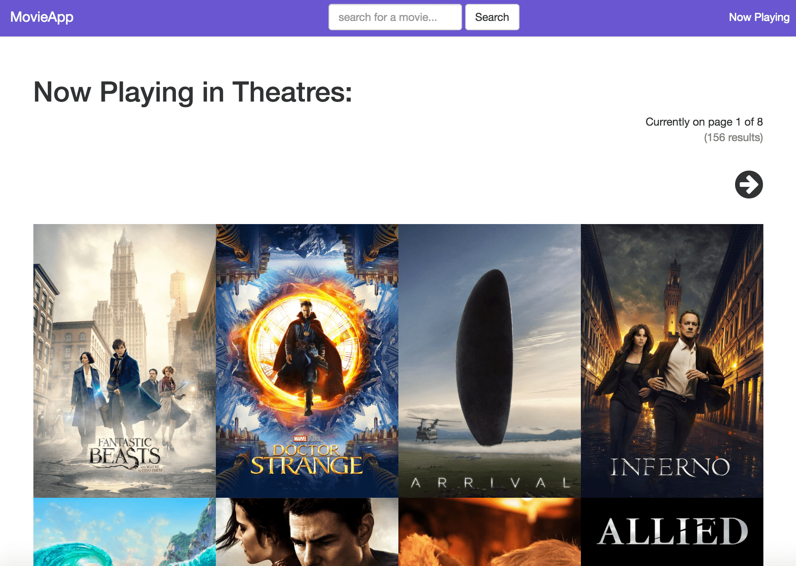
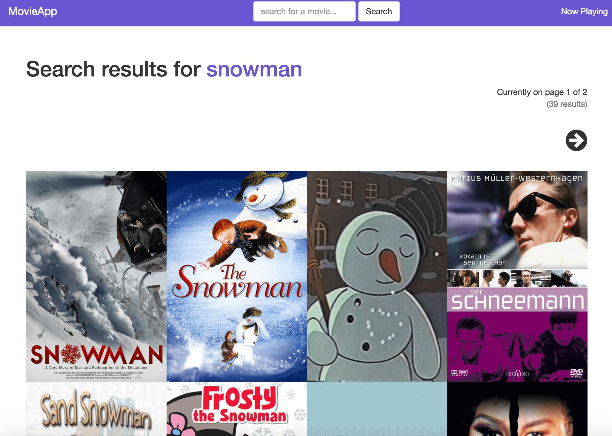
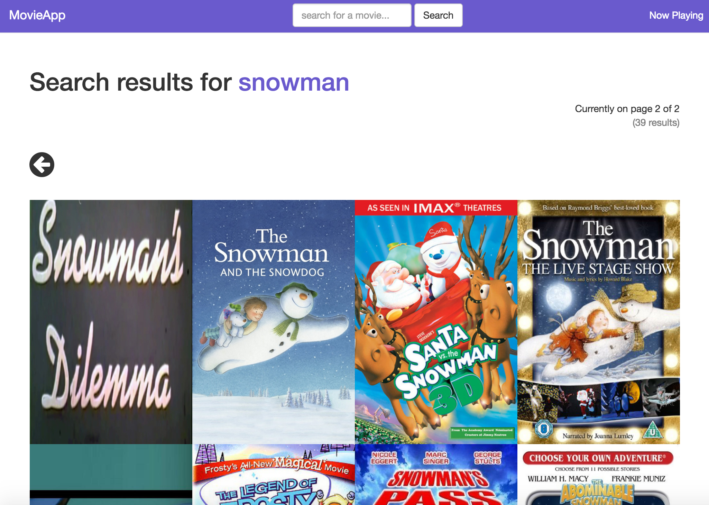
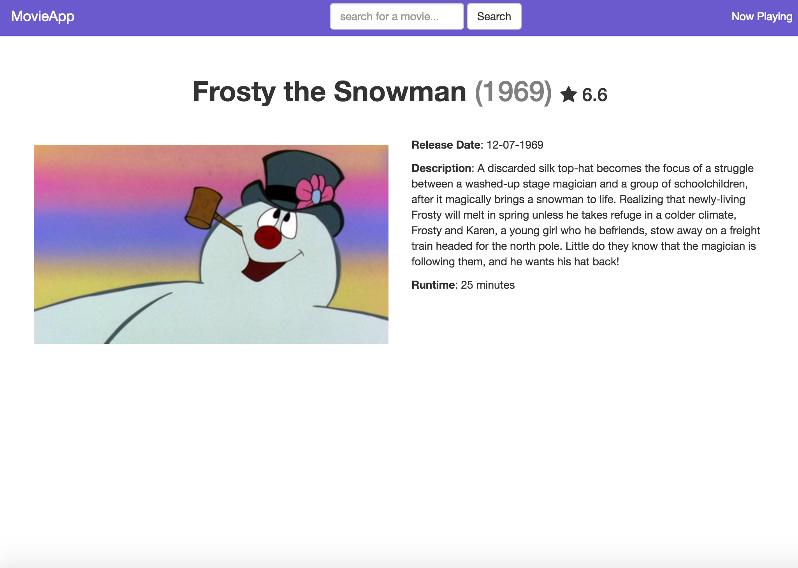

# MovieApp
---
### Objective:
create a movie search engine application using AngularJS, UI Router, Ajax, Angular Services, and the Movie Database API

### Live Demo:

TBD
<!-- [MovieApp] (http://xmasblackjack.surge.sh/) -->

### Languages used:

* HTML
* CSS
* BOOTSTRAP
* Javascript
* AngularJS
* Ajax
* Movie Database API

### Authors:

Carolyn Lam

### Routes (Walk-through w/ screenshots)

#####  1. Home Page => '/'

  * shows a link to now playing movies in the top right hand corner
  * features a movie search engine (displays in the middle of the page in only home page)

  

#####  2. Playing Now => '/playing_now/{page_number}'

  * displays results for movies currently playing in theaters
  * {page_number} => refers to the page number id
  * features a movie search engine in the nav bar
  * displays current page of results
  * displays total amount of results      

  

#####  3. Search Results Page => '/search/{search}/{page_number}'

  * {search} => refers to the search keyword (i.e. snowman)
  * features left and right arrows to change pages

  ###### Page 1 of results for snowman
    

  ###### Page 2 of results for snowman
    

#####  4. Movie Details Page => '/movie/{movie_id}'

  * shows info for one movie

  

### Further Info:

The first step in building this movie app was to first set up the structure. I created files, folders, and set up sections in the main js file that I named as movieapp.js. During the set up, I also included the ui-view element in the index.html file. The ui-view element acts as a portal to the ui router.

Afterward I created a simple search input field. I assigned the value of the input field to a scope variable using ng-model. Next I wanted to pass the search keyword value, along with the page number value to a new state that would handle the data. To do so, I used $state.go to pass the data and to change from one state to a new state.

This new state instantly calls a service from app.factory and passes it the search_keyword and page_number. However, before being able to pass it, the state grabs their values from stateParams and stores in into scope variables. The service makes an AJAX call to the search movies API and, upon success, returns the results back.

Then I am able to work with this new data and use it to the render the pages. In the html files, I use the ng-repeat directive to loop through the results. For example, in the search pages, I use ng-repeat to loop through the movies and display their images. I also added additional logic here, that if there wasn't a movie image available, it would show the name of the movie instead.

Creating the other pages (movie details page and now playing page) was handled very similarly to how the results page was created.

After creating the functionality, I then worked on creating a clean look.

### What I Learned

One of the biggest obstacles in this project was being able to show the movie search engine displayed differently across the pages. For instance, I wanted the search engine to appear in the middle of the screen in only the home page, and then feature it at the top of the page (inside a nav bar) on all others.

To achieve this, I ended up using app.run. Inside app.run I created a rootScope function that uses locationChangeStart to grab the next url that the user is changing to. It checks whether it is the home page or not. If so, I assigned true to a rootScope variable i'is_homepage' and false if not.

I then used these boolean values in my html files to display the correct search input field.

*** RootScope variables are not recommended. However, I think this was a good implementation of them. I am open-minded to using other options once I discover more ways of handling this problem.

### Code Samples

```
// form controller: the movie search engine is accessible on all the pages
// it has its own controller to be more versatile
app.controller('SearchController', function($scope, $state) {

  // the scope method takes in a search keyword that it will be searching for
  $scope.searchResults = function(search_keyword) {
    // state.go changes to a new state
    // pass in the search keyword we are searching
    // hard code the page number to 1 because it is the first page of the results
    $state.go('search_results', {'search': search_keyword, 'page_number': 1});
  }

})
```

```
// search results controller
app.controller('SearchResultsController', function($scope, $stateParams, MovieService, $state) {
  // grab the $stateParams values and save them to scope variables
  $scope.search_keyword = $stateParams['search'];
  $scope.page_number = Number($stateParams['page_number']);

  // instantly call searchResults service and pass in the search keyword user is looking up,
  // as well as the page number
  MovieService.searchResults($scope.search_keyword, $scope.page_number)
    // upon success, searchResults is return back
    .success(function(searchResults) {
      // save searchResults to a scope variable
      $scope.searchResults = searchResults;
      // save the total pages of results to a scope variable
      $scope.total_pages = searchResults.total_pages;
      // save the total number of results to a scope variable
      $scope.total_results = searchResults.total_results;
      //
      // $scope.searchResults.page = Number($scope.page_number);
    })

    // this scope method takes in a condition and the current page number
   // the condition is either 'subtract' or 'add'
    $scope.showNextPageResults = function(condition) {
      $scope.page_number = MovieService.showNextPageResults(condition, $scope.page_number);
      // use $state.go to change states (pass in the search_keyword and page_number values)
      $state.go('search_results', {'search_keyword': $scope.search_keyword, 'page_number': $scope.page_number});
    }

})
```

### What To Do Next:

  * add more styling
  * make more API calls
